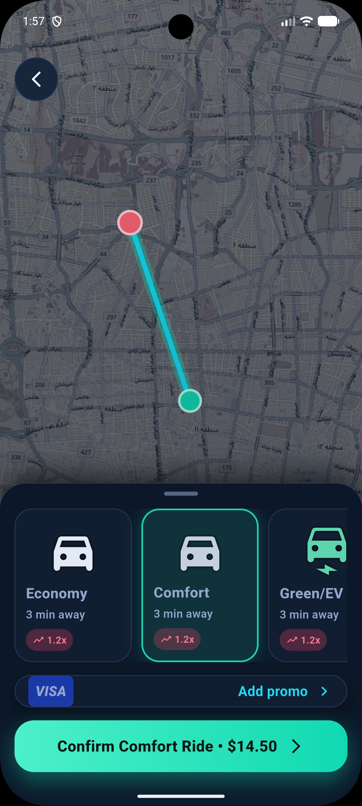

<div align="center">

# 🚕 Koolbar Demo | کولبار

**اپلیکیشن رزرو تاکسی و حمل‌ونقل هوشمند با Flutter**
**A production-grade Ride-Hailing & Navigation demo built with Flutter**

[](https://flutter.dev/)
[](https://dart.dev/)
[](#-architecture)
[](LICENSE)
[](#-contributing)

[Features](#-features) • [Architecture](#-architecture) • [Kalman Filter](#-gps-smoothing-with-kalman-filter) • [Getting Started](#-getting-started) • [Contributing](#-contributing)

</div>

---

## 📖 About

**Koolbar Demo** is a modular ride-hailing and navigation application that shows enterprise-level Flutter engineering. It combines **Clean Architecture**, smooth vector maps with **MapLibre GL**, and a **Kalman Filter** that removes noise from GPS streams. The result is stable, natural movement of the user and driver on the map.

> **کولبار دمو** یک اپلیکیشن ماژولار برای رزرو تاکسی و حمل‌ونقل است. این پروژه با معماری تمیز (Clean Architecture)، نقشه‌ی برداری MapLibre و فیلتر کالمن برای حذف نویز GPS ساخته شده است.

## 📸 Screenshots

<div align="center">


</div>

<!--
To add more screenshots, put the files in docs/screen-shots/ and add them side by side:

<div align="center">
  
  
  
  
</div>
-->

## ✨ Features

- 🧩 **Modular, feature-first architecture**: independent modules that are easy to scale and maintain.
- 📍 **Smart GPS telemetry**: a real-time Kalman Filter removes jitter, so markers move smoothly on the map.
- 🗺 **MapLibre GL maps**: vector tiles, custom layers and Neshan map service integration.
- 🧭 **Declarative navigation**: `go_router` with deep-linking and separate routes for each feature.
- 🏛 **Clean Architecture and SOLID**: clear Domain, Data and Presentation layers.
- 💉 **Dependency Injection**: IoC with `get_it` and `injectable`.

## 🏗 Architecture

The project follows **Clean Architecture** with a **layered-by-feature** layout. Dependencies always point inward, toward the Domain layer.

```
┌──────────────────────────────────────┐
│           Presentation               │  Pages, Widgets, State
├──────────────────────────────────────┤
│              Domain                  │  Entities, UseCases, Repository contracts
├──────────────────────────────────────┤
│               Data                   │  Models, DataSources, Repository impl
└──────────────────────────────────────┘
```

| Layer | Responsibility |
|-------|----------------|
| **Presentation** | UI, user interaction and state management |
| **Domain** | Business logic, pure Dart, independent of any framework |
| **Data** | API calls, local storage and mapping models to entities |

## 🧭 GPS Smoothing with Kalman Filter

Raw GPS data is noisy and makes markers jump on the map. The app runs a **Kalman Filter** on the location stream. It works in two steps:

1. **Predict:** estimates the next position from the previous state and speed.
2. **Update:** combines the prediction with the new measurement, weighted by measurement accuracy.

This gives a smooth path, less jitter and a better tracking experience for both passenger and driver.

## 🗺 Maps & Routing

- Vector map rendering with **MapLibre GL**
- Neshan map service for tiles and routing
- Custom layers for markers, routes and origin/destination

## 📦 Project Structure

```
lib/
├── core/                 # Shared utilities, DI, router, theme, network
├── features/
│   └── ...               # One folder per feature (data / domain / presentation)
└── main.dart
```

## 🛠 Tech Stack

| Category | Technology |
|----------|-----------|
| Framework | Flutter, Dart |
| Map | MapLibre GL, Neshan |
| Routing | go_router |
| DI | get_it, injectable |
| Signal filtering | Kalman Filter (custom implementation) |
| Architecture | Clean Architecture, Feature-First |

## 🚀 Getting Started

### Prerequisites

- Flutter SDK `>= 3.x`
- Dart SDK `>= 3.x`
- Android Studio or VS Code
- A Neshan API key (if you use Neshan services)

### Installation

```bash
# 1. Clone the repository
git clone https://github.com/ShahabSohrevardi/koolbar_demo.git
cd koolbar_demo

# 2. Install dependencies
flutter pub get

# 3. Generate code (injectable, etc.)
dart run build_runner build --delete-conflicting-outputs

# 4. Run the app
flutter run
```

### Configuration

Add your API keys to the project's config file. Never commit real keys to the repository.

### Build

```bash
flutter build apk --release        # Android
flutter build ios --release        # iOS
```

## 🗺 Roadmap

- [ ] Real-time driver matching
- [ ] Payment gateway integration
- [ ] Trip history
- [ ] Multi-language support (FA/EN)
- [ ] Unit and widget tests

## 🤝 Contributing

Contributions are welcome.

1. Fork the repository.
2. Create a feature branch: `git checkout -b feature/amazing-feature`
3. Commit your changes: `git commit -m "feat: add amazing feature"`
4. Push the branch: `git push origin feature/amazing-feature`
5. Open a Pull Request.

## 📄 License

This project is released under the [MIT License](LICENSE).

## 👤 Author

**Shahab Sohrevardi**
GitHub: [@ShahabSohrevardi](https://github.com/ShahabSohrevardi)

---

<div align="center">

⭐ If you like this project, give it a star!

</div>
