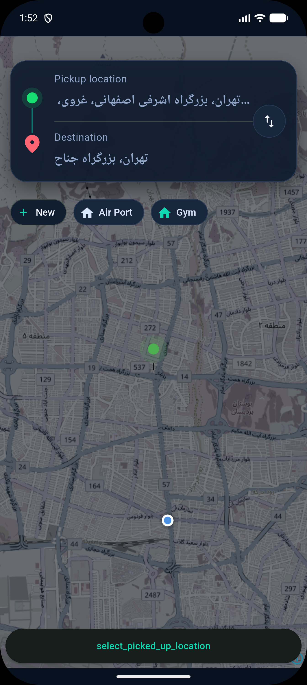
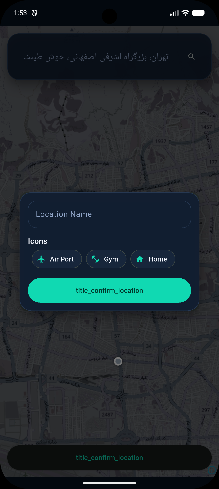
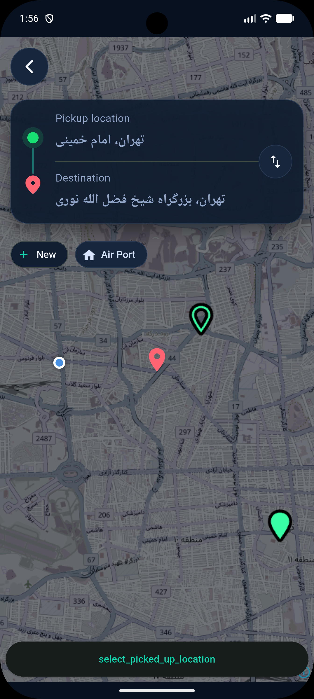
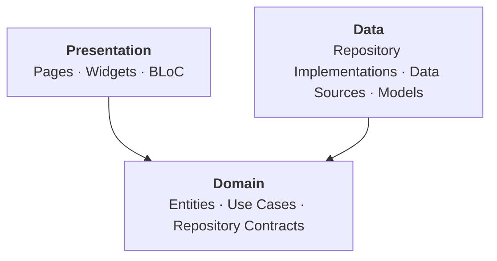
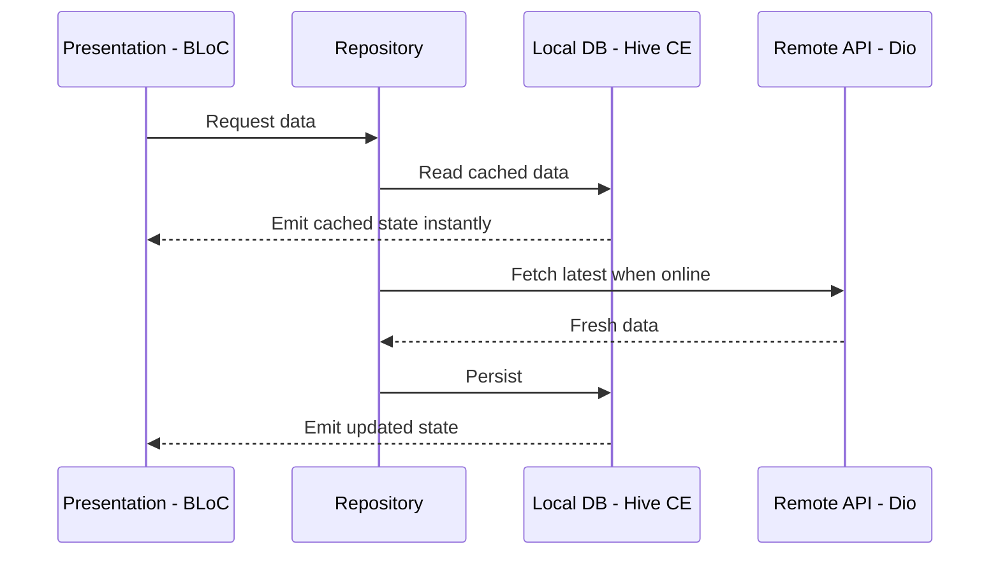

<div align="center">

# 🚕 Koolbar

### Offline-First Ride-Hailing & Navigation App built with Flutter

A **modular**, **Clean Architecture** mobile application engineered around **SOLID principles**, **dependency injection** and an **offline-first** data strategy.

[](https://flutter.dev/)
[](https://dart.dev/)
[](#-architecture)
[](#-solid-principles-in-practice)
[](#-offline-first-strategy)
[](#-modular-project-structure)
[](#-dependency-injection)
[](LICENSE)

[Highlights](#-engineering-highlights) •
[Architecture](#-architecture) •
[SOLID](#-solid-principles-in-practice) •
[Dependency Injection](#-dependency-injection) •
[Offline-First](#-offline-first-strategy) •
[Structure](#-modular-project-structure) •
[Getting Started](#-getting-started)

</div>

---

## 📖 Overview

**Koolbar** is a taxi-booking and navigation application that focuses on **software architecture quality** as much as on features. Every decision in the codebase serves three goals:

- **Maintainability:** strict layer boundaries and single-responsibility components.
- **Testability:** business logic depends on abstractions, never on frameworks or concrete implementations.
- **Resilience:** the app stays useful with poor or no connectivity because local storage is part of the core data flow.

> This repository is intended as a reference implementation of production-style Flutter architecture.

## 📸 Screenshots

<div align="center">



</div>

<!--
More screenshots: add files to docs/screen-shots/ and list them side by side:

<div align="center">
  
  
  
</div>
-->

## 🏆 Engineering Highlights

| Area | What was done | Why it matters |
|------|---------------|----------------|
| 🏛 **Clean Architecture** | Strict **Presentation → Domain ← Data** separation with the dependency rule enforced | Business rules are independent of UI, network and storage choices |
| 🧱 **SOLID Principles** | Small single-purpose classes, abstractions in the Domain layer, implementations in Data | Code that is easy to extend, refactor and unit-test |
| 💉 **Dependency Injection** | `get_it` + `injectable` with generated registration code | No manual wiring, no hidden singletons, swappable implementations |
| 📴 **Offline-First** | Local database (Hive CE) is part of the repository flow, the network refreshes it | Fast startup, instant UI and graceful behaviour without connectivity |
| 🧩 **Modular Design** | Feature modules, a shared `core`, and a dedicated `design_system` | Features evolve independently and scale with team size |
| 🗺 **Maps & Location** | `maplibre_gl` vector maps with `geolocator` and runtime permission handling | Smooth, customizable, vendor-neutral map rendering |
| 🔀 **Predictable State** | `flutter_bloc` with `equatable` value equality | Unidirectional data flow and reproducible UI states |
| 🧭 **Type-Safe Routing** | `auto_route` with code generation | Compile-time checked navigation and arguments |
| 🌍 **Localization** | `easy_localization`, `intl`, Persian calendar and number utilities | Ready for multi-language and RTL audiences |

## 🏗 Architecture

The app follows **Clean Architecture**. Source-code dependencies point **inward only**: the Domain layer knows nothing about Flutter, HTTP or databases.



| Layer | Responsibility | Depends on |
|-------|----------------|------------|
| **Presentation** | UI rendering, user interaction, state management with BLoC | Domain |
| **Domain** | Pure Dart business logic: entities, use cases and repository **interfaces** | Nothing |
| **Data** | Repository **implementations**, remote and local data sources, DTO mapping | Domain |

**Key consequences of this design**

- The UI can be replaced without touching business rules.
- The database or API client can be swapped without touching use cases.
- Use cases and BLoCs can be unit-tested with simple mocks, with no Flutter runtime needed.

## 🧠 SOLID Principles in Practice

| Principle | How it is applied |
|-----------|-------------------|
| **S**: Single Responsibility | Each use case performs one business action. Data sources only fetch or store. BLoCs only translate events into states. |
| **O**: Open/Closed | New behaviour is added by new implementations or use cases, without modifying existing, tested code. |
| **L**: Liskov Substitution | Any repository or data-source implementation can replace another (for example remote ↔ local ↔ fake) without breaking consumers. |
| **I**: Interface Segregation | Contracts are small and feature-specific, so consumers never depend on methods they do not use. |
| **D**: Dependency Inversion | High-level policy (Domain) defines abstractions. Low-level details (Data) implement them and are injected at runtime. |

## 💉 Dependency Injection

Dependencies are resolved through **`get_it`** as the service locator and **`injectable`** for annotation-based, **code-generated** registration.

- No hand-written registration boilerplate
- Constructor injection throughout, so dependencies are explicit
- Easy to replace implementations in tests

A simplified illustration of the pattern:

```dart
// Domain: abstraction
abstract class RideRepository {
  Future<List<Ride>> getRides();
}

// Data: implementation, registered automatically by injectable
@LazySingleton(as: RideRepository)
class RideRepositoryImpl implements RideRepository {
  RideRepositoryImpl(this._remote, this._local);

  final RideRemoteDataSource _remote;
  final RideLocalDataSource _local;

  @override
  Future<List<Ride>> getRides() async { /* local first, then refresh */ }
}
```

Generate the registrations with:

```bash
dart run build_runner build --delete-conflicting-outputs
```

## 📴 Offline-First Strategy

The local database is **part of the core data flow**, not a fallback added later. The UI is always rendered from local data, and the network keeps that data fresh.



**Benefits**

- ⚡ Instant screens, with no loading spinner for data the user has already seen
- 📶 Usable on weak or unstable mobile networks
- 🔋 Fewer redundant network calls
- 🧪 A single source of truth for the UI

## 🧩 Modular Project Structure

```
lib/
├── app/               # App bootstrap, root widget and global wiring
├── core/
│   ├── common/        # Shared abstractions and cross-cutting code
│   ├── db/            # Local persistence layer (offline-first storage)
│   ├── network/       # HTTP client and networking infrastructure
│   └── utilities/     # Helpers and extensions
├── design_system/     # Reusable UI components and theming
├── features/
│   └── ride_request/  # Self-contained feature module (data · domain · presentation)
└── main.dart          # Entry point
```

**Design rules**

- **Feature modules** are self-contained and own their own data, domain and presentation layers.
- **`core`** holds infrastructure shared by all features and never depends on a feature.
- **`design_system`** keeps the UI building blocks separate from feature code, so the look and feel stays consistent.
- Adding a new feature means adding a new folder under `features/`, with no changes to existing features.

## 🛠 Tech Stack

| Category | Technologies |
|----------|--------------|
| **Framework** | Flutter, Dart |
| **State Management** | `flutter_bloc`, `equatable`, `rxdart` |
| **Dependency Injection** | `get_it`, `injectable`, `injectable_generator` |
| **Routing** | `auto_route` (code-generated, type-safe) |
| **Networking** | `dio` |
| **Local Storage** | `hive_ce`, `hive_ce_flutter`, `shared_preferences` |
| **Maps & Location** | `maplibre_gl`, `geolocator`, `permission_handler` |
| **Serialization** | `json_annotation`, `json_serializable` |
| **Localization** | `easy_localization`, `intl`, `persian_datetime_picker`, `persian_tools` |
| **Configuration** | `flutter_dotenv` |
| **UI & UX** | `responsive_framework`, `flutter_animate`, `shimmer`, `cached_network_image`, `flutter_svg` |
| **Code Quality** | `flutter_lints`, `build_runner` |

## 🚀 Getting Started

### Prerequisites

- Flutter SDK (stable channel) with Dart SDK `^3.13.4`
- Android Studio or VS Code with the Flutter plugin
- An Android emulator/device or an iOS simulator/device

### Installation

```bash
# 1. Clone the repository
git clone https://github.com/ShahabSohrevardi/koolbar_demo.git
cd koolbar_demo

# 2. Install dependencies
flutter pub get

# 3. Generate DI, routing, serialization and Hive adapters
dart run build_runner build --delete-conflicting-outputs

# 4. Run the app
flutter run
```

### Configuration

Runtime configuration is loaded with `flutter_dotenv` from a `.env` file in the project root, which is declared as an asset in `pubspec.yaml`. Review the file and provide your own values before running.

> ⚠️ Never commit real secrets or API keys to version control.

### Build

```bash
flutter build apk --release    # Android
flutter build ios --release    # iOS
```

## 🎯 Skills Demonstrated

- Designing and enforcing **Clean Architecture** boundaries in a real Flutter codebase
- Applying **SOLID principles** and **Dependency Inversion** with generated DI
- Building an **offline-first** data layer with local persistence
- Structuring a **modular, scalable** project with shared core and design system
- Integrating **vector maps, location services and permissions**
- **BLoC** state management, type-safe routing and code generation workflows

## 🗺 Roadmap

- [ ] Real-time driver matching
- [ ] Payment gateway integration
- [ ] Trip history
- [ ] Unit and widget test coverage for use cases and BLoCs
- [ ] CI pipeline (analyze, test, build)

## 🤝 Contributing

Contributions, issues and feature requests are welcome.

1. Fork the repository
2. Create a feature branch: `git checkout -b feature/amazing-feature`
3. Commit using Conventional Commits: `git commit -m "feat: add amazing feature"`
4. Push the branch: `git push origin feature/amazing-feature`
5. Open a Pull Request


## 👤 Author

**Shahab Sohrevardi**
GitHub: [@ShahabSohrevardi](https://github.com/ShahabSohrevardi)

<!-- Add your LinkedIn and email here for CV use -->

---

<div align="center">

⭐ If this project helped or inspired you, please consider giving it a star.

</div>
